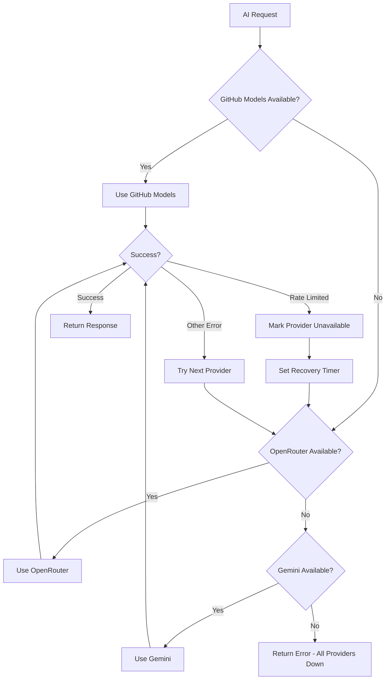

# AI Model Rotation System - Architecture Plan

## 🎯 Project Overview

Create a centralized AI model rotation system in n8n that automatically switches between free AI providers when rate limits are hit. This system will serve as a reliable AI backend for all your n8n automations.

## 🏗️ Selected AI Providers

Starting with these three providers for the initial implementation:

### 1. **GitHub Models** (Primary - Enhanced with Pro)
- **Models**: GPT-4o, Claude 3.5 Sonnet, Llama 3.1, Phi-3
- **Benefits**: Enhanced limits with GitHub Pro for Students
- **Rate Limits**: Significantly higher than standard free tier
- **Best For**: High-quality responses, complex reasoning

### 2. **OpenRouter** (Secondary)
- **Models**: Multiple free models including Llama, Mixtral, others
- **Benefits**: Model variety, good free tier limits
- **Rate Limits**: Varies by model, generally generous
- **Best For**: Fallback option with model flexibility

### 3. **Google Gemini** (Tertiary)
- **Models**: Gemini 1.5 Flash (free tier)
- **Benefits**: Fast responses, good for simple tasks
- **Rate Limits**: 15 requests per minute (free tier)
- **Best For**: Quick responses, lightweight tasks

## 🔄 Rotation Strategy



## 🏛️ System Architecture

### Core Components

1. **AI Router Workflow**
   - Main webhook endpoint for AI requests
   - Provider selection and rotation logic
   - Standardized response formatting

2. **Provider Status Manager**
   - Tracks availability of each provider
   - Manages rate limit recovery timers
   - Persists state between requests

3. **Request Handler**
   - Formats requests for each provider's API
   - Handles provider-specific authentication
   - Normalizes responses

## 📋 Implementation Plan

### Phase 1: Core Infrastructure
1. Set up n8n environment (Docker recommended)
2. Create main AI router workflow with webhook trigger
3. Implement basic provider rotation logic
4. Add error handling and logging

### Phase 2: Provider Integration
1. **GitHub Models Integration**
   - Authenticate with GitHub token
   - Implement model selection logic
   - Handle GitHub-specific rate limits

2. **OpenRouter Integration**
   - Configure API authentication
   - Implement model fallback chain
   - Handle OpenRouter rate limiting

3. **Google Gemini Integration**
   - Set up Google AI Studio API
   - Implement request formatting
   - Handle Gemini rate limits (15 req/min)

### Phase 3: Advanced Features
1. Provider status persistence
2. Automatic recovery timers
3. Usage analytics and logging
4. Request optimization

## 🔧 Technical Specifications

### Webhook Interface
All your n8n workflows will call this standardized endpoint:

**Request Format:**
```json
{
  "prompt": "Your AI request here",
  "model_type": "chat|code|creative",
  "max_tokens": 1000,
  "temperature": 0.7,
  "system_prompt": "Optional system instructions"
}
```

**Response Format:**
```json
{
  "success": true,
  "response": "AI generated response",
  "provider": "github_models",
  "model": "gpt-4o",
  "tokens_used": 150,
  "processing_time": 2.3
}
```

### Rate Limit Handling

**GitHub Models:**
- Detection: HTTP 429 or quota exceeded errors
- Recovery: 1 hour cooldown
- Fallback: Immediate switch to OpenRouter

**OpenRouter:**
- Detection: Rate limit headers and 429 errors
- Recovery: 15 minutes cooldown
- Fallback: Switch to Gemini

**Google Gemini:**
- Detection: 429 errors or quota exceeded
- Recovery: 1 minute cooldown (15 req/min limit)
- Fallback: Return to GitHub Models if available

### Provider Priority Logic

1. **Primary**: GitHub Models (best quality, highest limits)
2. **Secondary**: OpenRouter (good fallback, multiple models)
3. **Tertiary**: Gemini (fast responses, limited capacity)

## 📁 Files to Create

1. **n8n Workflows:**
   - `ai-router-main.json` - Main routing workflow
   - `provider-status-manager.json` - Status tracking workflow
   - `rate-limit-recovery.json` - Timer-based recovery workflow

2. **Configuration Files:**
   - `docker-compose.yml` - n8n deployment setup
   - `env.example` - Environment variables template
   - `provider-config.json` - Provider settings

3. **Documentation:**
   - `setup-guide.md` - Step-by-step setup instructions
   - `api-usage-examples.md` - How to use from other workflows
   - `troubleshooting.md` - Common issues and solutions

## 🚀 Deployment Approach

**Recommended Setup:**
- **n8n**: Self-hosted via Docker for unlimited workflows
- **Database**: SQLite for provider status persistence
- **Environment**: Local development with easy cloud migration
- **Security**: Environment variables for all API keys

## 🔑 Required API Keys

1. **GitHub Personal Access Token** (for GitHub Models)
2. **OpenRouter API Key** (free account)
3. **Google AI Studio API Key** (free account)

## 📊 Success Metrics

- **Availability**: >99% uptime across all providers
- **Response Time**: <5 seconds average
- **Fallback Success**: <2 second provider switching
- **Rate Limit Recovery**: Automatic within defined timeframes

## 🔄 Future Expansion

After successful implementation with these three providers, easy to add:
- Groq (ultra-fast inference)
- Hugging Face Inference API
- Together AI
- Cohere
- Additional models from existing providers

---

This plan provides a solid foundation for reliable AI integration across all your n8n automations while maximizing the benefits of your GitHub Pro student access.